# data-structure-5
## 7 图  
### 7.1 各种图定义  
*   
图G(V,E),G表示一个图，V是图G中顶点的集合，E是图G中边的集合  
*   
线性表中的数据元素叫元素  
树---结点  
图---顶点  
注意：在图结构中，不允许没有顶点  
* 
线性表相邻数据元素之间具有线性关系  
树----层次关系  
图----边关系  
*   
无向图G1=(V1,{E1}),其中顶点集合V1={A,B,C,D};无向边集合E1={(A,B),(B,C),(C,D),(D,A),(A,C)}  
有向图G2=(V2,{E2}),其中顶点集合V2={A,B,C,D};有向边(弧)集合E2={<A,D>,<C,A>,<B,A>,<B,C>}  
<弧头，弧尾>  
*   
无向完全图：任意两个顶点之间都存在边，含有n个顶点的无向完全图有n*(n-1)/2条边  
有向完全图：------------------方向互为相反的两条弧，含有n个顶点的有向完全图有n*(n-1)条弧  
*   
稀疏图与稠密图  
*   
带权的图称为网  
*   
子图  
邻接点  
度（入度，出度）  
路径，路径长度（表示路径上的边或弧的数目）  
回路/环，简单回路/简单环  
* 连通图相关术语  
连通图，强连通图
连通分量，强联通分量  
### 7.2 图的存储结构  
#### 7.2.1 邻接矩阵  
二维数组  
无向图  
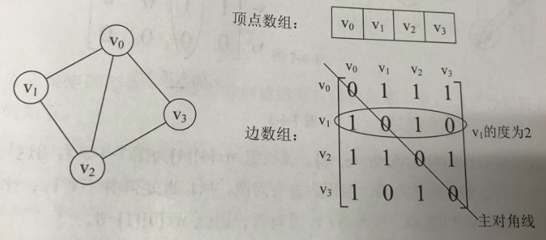  
有向图  
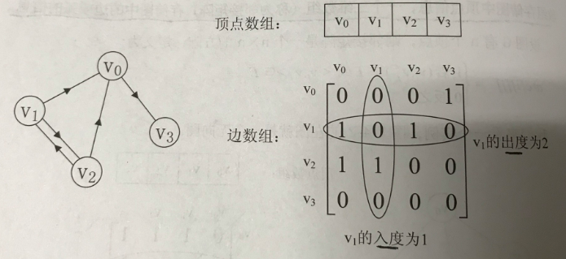  
带权的有向图（网）  
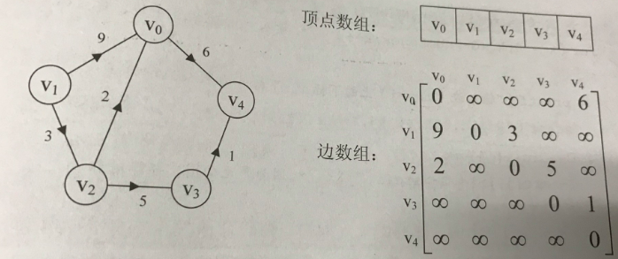  
#### 7.2.2 邻接表  
针对边数相对顶点较少的图，这种结构对存储空间会造成极大浪费  
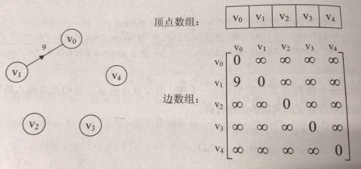  
采用一维数组+链表的存储方式：将顶点存储在一个一维数组中，将顶点的所有邻接点构成一个链表，无向图称为顶点vi的边表，有向图称为顶点vi作为弧尾的出边表  
无向图的邻接表  
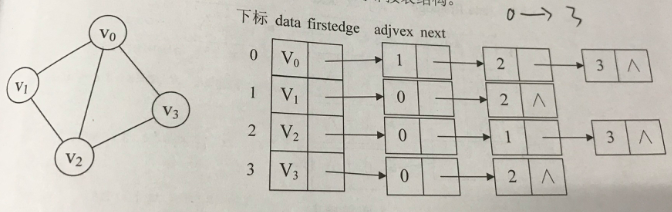  
有向图的邻接表和逆邻接表  
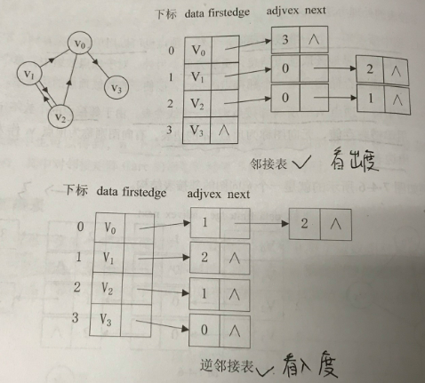  
带权值网图的邻接表  
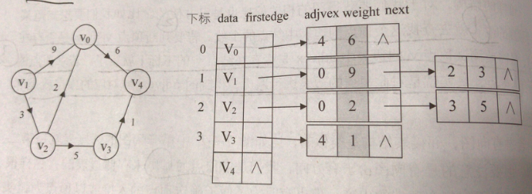  
#### 7.2.3 十字链表  
对于有向图，邻接表能看到出度，逆邻接表能看到入度，十字链表就是将邻接表与逆邻接表结合起来  
顶点结构：data，firstin，firstout  
边表结构：trailvex，headvex，headlink,taillink  
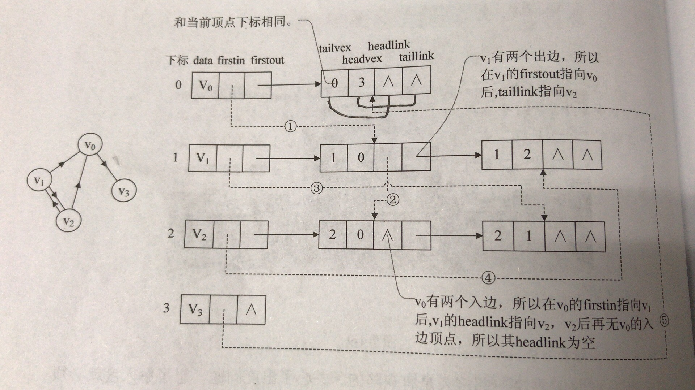  
图中虚线代表逆邻接表，实线代表邻接表  
#### 7.2.4 邻接多重表  
针对无向图，如果关注顶点的操作可以用邻接表，如果更关注边的操作，可以用邻接多重表  
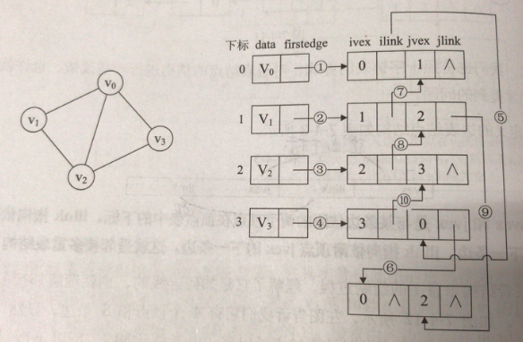  
#### 7.2.5 边集数组  
边集数组由两个一维数组构成，一个存储顶点的信息，另一个存储边的信息，更适合对边进行的操作  
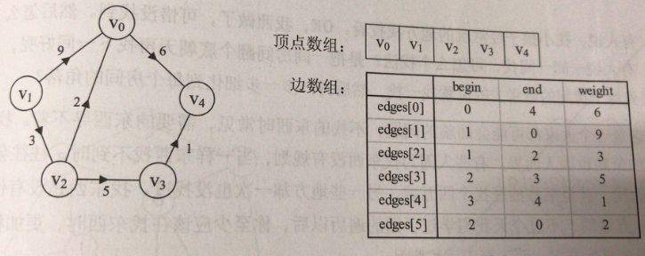  
### 7.3 图的遍历  
通常有两种遍历方案，深度优先遍历（depth first search）DFS，广度优先遍历（breadth first search）BFS  
DFS适合目标明确，以找到目标为目的的情况，广度优先适合在不断扩大遍历范围时找到相对最优解的情况  
### 7.4 最小生成树  
典型案例：工程师在村庄间假设通信网络  
构造连通网的最小生成树的两种经典算法，prim算法和kruskal算法  
#### 7.4.1 prim算法  
#### 7.4.1 kruskal算法  
prim算法适合稠密图，kruskal算法适合稀疏图  
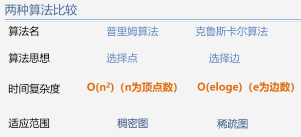  
### 7.5 最短路径  
典型案例：从出发地a到目的地b  
dijkstra算法和floyd算法  
#### 7.5.1 dijkstra算法-单源最短路径  
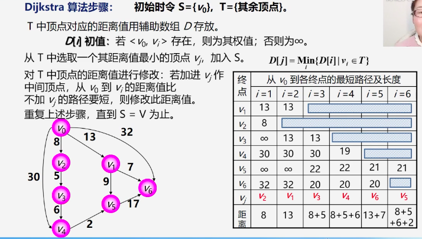  
求一个源点到其他所有顶点的最短距离，dijkstra算法的时间复杂度为O(n^2)，如果要求所有顶点之间的最短距离？则以每一个顶点作为源点，对每一个顶点都执行dijkstra算法，时间复杂度为O(n^3),这是一种方法，另一种方法就是用下面要说的floyd算法  
#### 7.5.2 floyd算法-所有顶点间的最短路径  
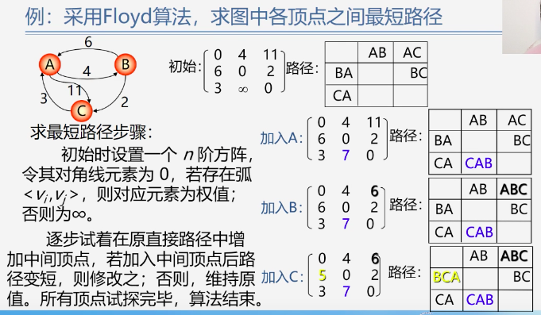  
### 7.6 拓扑排序  
最小生成树和最短路径问题都属于有环图的应用  
典型案例：生活中的电影制作，施工过程，排课，这样的工程图属于无环的有向图，用AOV网来表示  
注意：在AOV网中不能存在回路  
明确几个概念：前驱，后继，直接前驱，直接后继  
问题：如何判断AOV网中是否有环（回路）？  怎样排课？要解决这些问题就要用到拓扑排序  
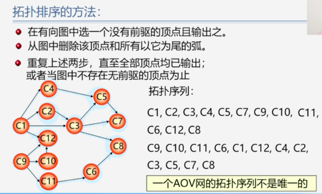  
如果网中所有顶点都在它的拓扑有序序列中，则不存在环  
### 7.7 关键路径  
典型案例：造汽车  
在AOV网的基础上，用边上的权值来表示活动的持续时间，称之为AOE网  
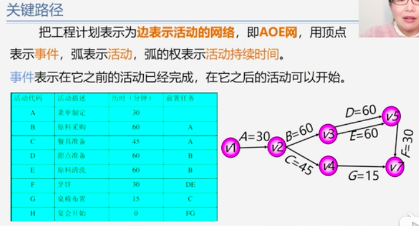  
拓扑排序AOV是为了解决一个工程能否顺利进行的问题，对于AOE网，我们最关心的是两个问题：完成整项工程需要多少时间？哪些活动是影响进度的关键？  
要解决这个问题，就要找到关键路径——路径上各活动持续时间最长的路径  
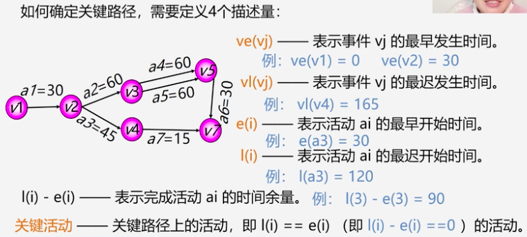  
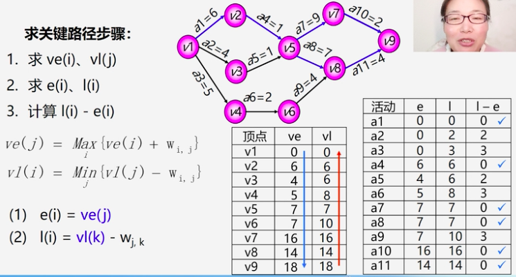  
